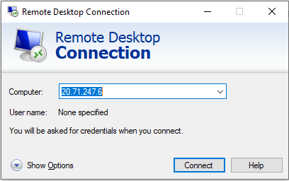

# Laboratorio de Monitorización -  Nagios 
### Objetivo del laboratorio
+ A través de este laboratorio instalaremos y usaremos una solución de monitorización con el software nagios.
+ Instalaremos y configuraremos los agentes de monitorización de Nagios en Linux, Windows y una máquina de Linux con un Base de datos Oracle.
+ Monitorizaremos diferentes eventos de cada una de las máquinas.

### 1.- Instalar Az Powershell (administrador):
Los portatiles de Capgemini ya tienen habilitada la función de PowerShel por lo que podréis acceder a la misma a través del menú de inicio de Windows sin necesidad de instalar Powershell. Si empleáis algun Software como [Visual Studio Code](https://code.visualstudio.com/), del que hablaremos mucho a lo largo de las prácticas, también tiene integrado, en su consola, Powershell.

+ Revisar versión de PowerShell:
 
  ```powershell
    $PSVersionTable.PSVersion
  ```

  El resultado debería ser similar a lo mostrado en la siguiente captura de pantalla. A partir de la versión 3 de PowerShell se puede instalar sin problemas el paquete de Azure Power Shel:

  

+ Instalar el modulo de Azure PowerShell (El proceso de instalación puede demorarse un rato considerable en función de la velocidad de vuestra red):

  ```powershell
    Install-Module -Name Az -Scope CurrentUser -Repository PSGallery -Force
  ```

  

  


###  2.- Despliegue del entorno de laboratorio
#### Despliegue automatizado del laboratorio (Script de Powershell)
Para desplegar el laboratorio de la forma más rápida, sencilla y transparente se ha creado un script de Powershell con un pequeño menú que os permitirá desplegar el entorno del laboratorio en el portal de Azure.

Para ello simplemente, desde una ventana de Powershell ejecutar el script <code>configurarlaboratorio.ps1</code> desde el directorio ServerNagios y seleccionar la opción [3]
  
```Powershell
  .\configurarlaboratorio.ps1
```

En caso de fallo en la ejecución del script podéis desplegarlo mediante el [procedimiento manual](./doc/install-manual-laboratorio.md): 

**Por ahorro de costes UNA VEZ DESPLEGADO EL LABORATORIO APAGAD AQUELLAS MÁQUINAS QUE NO VAYÁIS A USAR**


###  3.- Arranque Escritorio Remoto a la máquina de Windows
La conexión con nuestra máquina windows se realizará a través de RDP por medio de la IP Pública que la máquina tiene asignada y que podrás consultar en el portal de azure:


Una vez tengamos localizada nuestra Ip Pública simplemente lanzaremos una conexión RDP hacia esa IP con el cliente de Escritorio Remoto de Windows:

