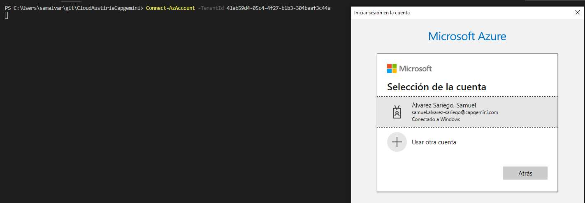
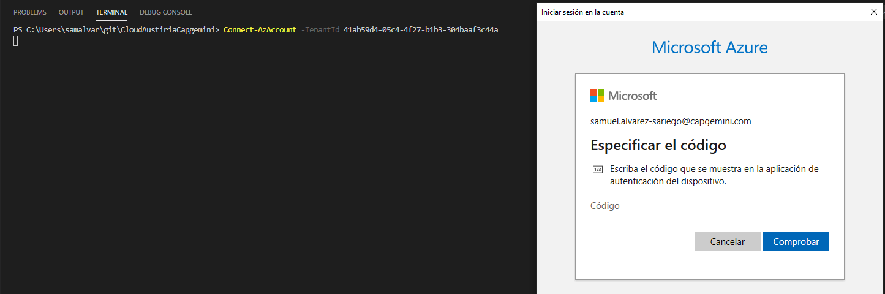
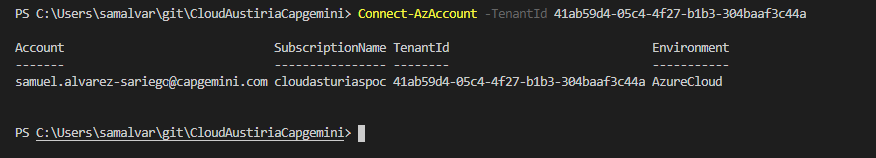

#  Despliegue no automatizado del entorno de laboratorio

**Esta solución debe emplearse en caso de fallo con la solución automatizada**

### 1.- Conectar al tenant de azure: 

El primer punto en el despliegue manual de nuestro laboratorio será conectarnos con el tenant de azure correspondiente:
  
  ```powershell
    Connect-AzAccount -TenantId 41ab59d4-05c4-4f27-b1b3-304baaf3c44a
  ```

  

  Una vez seleccionado el usuario nos indicará que introduzcamos el código del doble factor de autenticación:

  

  Una vez conectado al tenant, en el prompt del Powershell deberías ver la siguiente salida:
  
  

### 2.- Desplegar el entorno del laboratorio: 

Una vez conectado correctamente a nuestro tenant de azure podremos empezar a desplegar nuestro laboratorio:

Como primer paso y de cara a poder gestionar mejor los recursos de cada alumno, debe editarse el fichero parameters.json realizando los siguientes cambios:

+ Añadir las inciales de tu nombre y apellidos después del value en el campo "iniciales" del fichero de parámetros (en el ejemplo se indica como xxx):

  ```json
      "iniciales": {
        "value": "xxx" 
      }, 
  ```
* Esto va a permitir que todos los recursos que despliegues en este laboratorio tengan las inciales de tu nombre en el nombre del recurso *

+ Desde git://CloudAustiriaCapgemini\ServerNagios\ copiad y pegad modificando la variable "$deploymentName" por el nombre que se desee añadir al despliegue:

  ```powershell
  $deploymentName="Nombrequequeraisponerle"
  $templateFile = ".\resources\template.json"
  $parameterFile=".\resources\parameters.json"

  New-AzResourceGroupDeployment `
  -Name $deploymentName `
  -ResourceGroupName MonitoringPOC `
  -TemplateFile $templateFile `
  -TemplateParameterFile $parameterFile
  ```